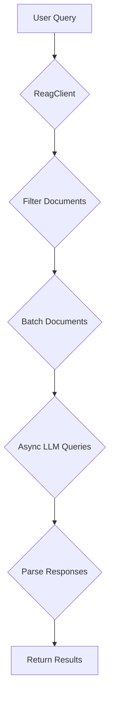
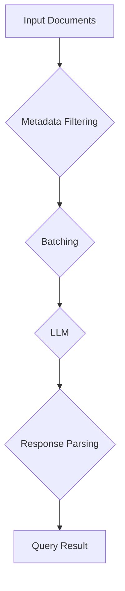

# 🎓 ReAG Python SDK

ReAG is a Python SDK for building Retrieval-Augmented Generation (RAG) applications. It provides a flexible and easy-to-use client for querying large language models (LLMs) with your own data.

## Features

- **Multi-Provider Support**: Works with various LLM providers, including Ollama, Groq, Hugging Face, and OpenRouter.
- **Asynchronous API**: Fully asynchronous, making it ideal for high-performance applications.
- **Conversation Memory**: Remembers past interactions to provide context-aware responses.
- **Streaming Support**: Supports streaming responses for real-time applications.
- **Metadata Filtering**: Filter documents based on metadata to narrow down the context for your queries.
- **Pydantic Schemas**: Uses Pydantic for robust data validation and schema definition.

## Installation

1.  Ensure Python 3.9+ is installed.
2.  Install using pip or poetry:

    ```bash
    pip install reag
    # or
    poetry add reag
    ```

## Quick Start

```python
import asyncio
from reag.client import ReagClient, Document

async def main():
    async with ReagClient(
        model="ollama/deepseek-coder:6.7b",
        model_kwargs={"api_base": "http://localhost:11434"}
    ) as client:
        docs = [
            Document(
                name="Superagent",
                content="Superagent is a workspace for AI-agents that learn, perform work, and collaborate.",
                metadata={
                    "url": "https://superagent.sh",
                    "source": "web",
                },
            ),
        ]
        response = await client.query("What is Superagent?", documents=docs)
        print(response[0].content)

if __name__ == "__main__":
    asyncio.run(main())
```

## API Reference

### `ReagClient`

The `ReagClient` is the main entry point for interacting with the SDK.

**Initialization**

```python
from reag.client import ReagClient
from reag.memory import Memory

client = ReagClient(
    model="ollama/deepseek-coder:6.7b",  # LiteLLM model name
    system="You are a helpful assistant.",  # Optional system prompt
    batch_size=20,  # Optional batch size
    schema=None,  # Optional Pydantic schema
    model_kwargs={"api_base": "http://localhost:11434"},  # Optional model-specific arguments
    memory=Memory(),  # Optional memory for conversation history
)
```

**Methods**

-   `query(prompt: str, documents: List[Document], options: Optional[Dict] = None, stream: bool = False)`: Queries the LLM with the given prompt and documents.
    -   `prompt`: The user's query.
    -   `documents`: A list of `Document` objects to provide as context.
    -   `options`: A dictionary of options, such as metadata filters.
    -   `stream`: Whether to stream the response.

### `Document`

The `Document` class represents a piece of data to be used as context for the LLM.

```python
from reag.client import Document

doc = Document(
    name="Superagent",
    content="Superagent is a workspace for AI-agents that learn, perform work, and collaborate.",
    metadata={
        "url": "https://superagent.sh",
        "source": "web",
    },
)
```

### `Memory`

The `Memory` class stores the conversation history.

```python
from reag.memory import Memory

memory = Memory()
```

### Metadata Filtering

You can filter documents by metadata using the `filter` option in the `query` method.

```python
options = {
    "filter": [
        {"key": "source", "value": "web", "operator": "equals"},
        {"key": "version", "value": 2, "operator": "greaterThanOrEqual"},
    ]
}
```

**Supported Operators**

-   `equals`
-   `notEquals`
-   `contains`
-   `startsWith`
-   `endsWith`
-   `regex`
-   `greaterThan`
-   `lessThan`
-   `greaterThanOrEqual`
-   `lessThanOrEqual`

## Examples

### Ollama

```python
import asyncio
from reag.client import ReagClient, Document

async def main():
    async with ReagClient(
        model="ollama/deepseek-coder:6.7b",
        model_kwargs={"api_base": "http://localhost:11434"}
    ) as client:
        docs = [
            Document(
                name="Superagent",
                content="Superagent is a workspace for AI-agents that learn, perform work, and collaborate.",
            ),
        ]
        response = await client.query("What is Superagent?", documents=docs)
        print(response[0].content)

if __name__ == "__main__":
    asyncio.run(main())
```

### Groq

```python
import asyncio
from reag.client import ReagClient, Document

async def main():
    async with ReagClient(
        model="groq/llama3-8b-8192",
        model_kwargs={"api_key": "YOUR_GROQ_API_KEY"}
    ) as client:
        docs = [
            Document(
                name="Superagent",
                content="Superagent is a workspace for AI-agents that learn, perform work, and collaborate.",
            ),
        ]
        response = await client.query("What is Superagent?", documents=docs)
        print(response[0].content)

if __name__ == "__main__":
    asyncio.run(main())
```

### Hugging Face

```python
import asyncio
from reag.client import ReagClient, Document

async def main():
    async with ReagClient(
        model="huggingface/meta-llama/Meta-Llama-3-8B",
        model_kwargs={"api_key": "YOUR_HUGGINGFACE_API_KEY"}
    ) as client:
        docs = [
            Document(
                name="Superagent",
                content="Superagent is a workspace for AI-agents that learn, perform work, and collaborate.",
            ),
        ]
        response = await client.query("What is Superagent?", documents=docs)
        print(response[0].content)

if __name__ == "__main__":
    asyncio.run(main())
```

### OpenRouter

```python
import asyncio
from reag.client import ReagClient, Document

async def main():
    async with ReagClient(
        model="openrouter/google/gemini-flash-1.5",
        model_kwargs={"api_key": "YOUR_OPENROUTER_API_KEY"}
    ) as client:
        docs = [
            Document(
                name="Superagent",
                content="Superagent is a workspace for AI-agents that learn, perform work, and collaborate.",
            ),
        ]
        response = await client.query("What is Superagent?", documents=docs)
        print(response[0].content)

if __name__ == "__main__":
    asyncio.run(main())
```

## Conceptual Overview

Retrieval-Augmented Generation (RAG) is a technique that combines the strengths of large language models (LLMs) with external knowledge sources. It works by retrieving relevant information from a knowledge base and providing it to the LLM as context for generating a response.

This approach helps to:

-   **Reduce Hallucinations**: By grounding the LLM in factual data, RAG reduces the likelihood of generating false or misleading information.
-   **Improve Relevance**: The retrieved context helps the LLM to generate more relevant and accurate responses.
-   **Enable Knowledge Updates**: RAG allows you to update the knowledge base without retraining the LLM.

### Request Lifecycle



### Data Processing Pipeline


